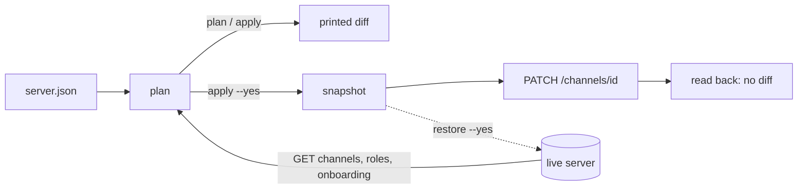

# OpenDrone Discord

Configuration as code for the [OpenDrone Discord server](https://discord.gg/v3sWmTcx3R).

| Part | What it is | Guide |
|---|---|---|
| `server.json` + `discord_config.py` | Channel permission overwrites, names, topics and categories, planned and applied from Git | This file |
| `bot/` | Cloudflare Worker bot: GitHub webhooks into Discord, linked roles | [bot/README.md](bot/README.md) |



## Commands

The bot token is read from `OPENDRONE_DISCORD_BOT_TOKEN` in the environment, else
from `~/.config/incutec/credentials.env`. Python 3.10+, standard library only.
If Python has no CA store (python.org builds on macOS), `/etc/ssl/cert.pem` is used.

| Command | Reads | Writes |
|---|---|---|
| `python3 discord_config.py plan` | Channels, roles, onboarding | Nothing; prints the diff |
| `python3 discord_config.py apply` | Channels, roles, onboarding | Nothing; same diff, then "Dry run" when there is a change |
| `python3 discord_config.py apply --yes` | Channels, roles, onboarding | Snapshot, one `PATCH /channels/{id}` per changed channel, then reads back |
| `python3 discord_config.py audit` | Channels, roles, onboarding | Snapshot only |
| `python3 discord_config.py restore snapshots/<file>.json` | Roles, the snapshot | Nothing; lists what would be restored |
| `python3 discord_config.py restore snapshots/<file>.json --yes` | Roles, the snapshot | Permission overwrites of every managed channel, from the snapshot |

`--config <path>` (before the command) uses another file than `server.json`.
Every write carries the audit log reason `OpenDrone-hw/discord discord_config.py`.

## `server.json`

| Key | Meaning |
|---|---|
| `guild_id` | The server |
| `profiles` | Named overwrite sets: `{role name: {allow: [...], deny: [...]}}`. Permission names are Discord's flag names (`VIEW_CHANNEL`, `SEND_MESSAGES`, ...); `@everyone` is the everyone role |
| `categories[]` | `id`, `name`, `access` (a profile name or an inline overwrite set), `channels[]` |
| `channels[]` | `id`, `name`, optional `topic`, optional `access`; without `access` a channel gets its category's |

What `plan` compares per managed channel:

| Field | Source in `server.json` |
|---|---|
| `name` | `name` |
| `topic` | `topic`, only when present |
| `parent_id` | The enclosing category's `id` (so moving a channel to another category is a change) |
| Role overwrites | `access` of the channel or its category |

Every listed `id` must exist: the tool does not create channels, roles, forums or
anything else. Roles are resolved by name, and the tool refuses to run if two roles
share a name. An unknown profile, role or permission name, a permission both
allowed and denied, or a channel listed twice stops the run before any request
that writes.

## Safety rules

| Rule | Effect |
|---|---|
| Only listed channels are managed | Anything not in `server.json` is printed as unmanaged and never touched |
| Nothing is deleted | Channels are changed in place; the tool has no delete call |
| Member overwrites are kept by apply | Only role overwrites are compared and written; `apply --yes` copies member overwrites into its PATCH unchanged |
| Snapshot before every apply | `snapshots/` (git-ignored) holds channels, roles and onboarding as fetched |
| Read back after every apply | `apply --yes` fails if the server still differs from `server.json` |
| Restore is overwrites only | `restore --yes` writes the snapshot's full overwrite list, member overwrites included, for managed channels present in the snapshot; member overwrites added after the snapshot are dropped. Names, topics, parents, roles and onboarding in the snapshot are not restored |
| Rate limits | On 429 the tool waits `retry_after` and retries, 5 attempts per request |

## Manual steps (Discord UI only)

These have no API, or are outside what `discord_config.py` manages.

| Step | Where | Why |
|---|---|---|
| Server Guide: welcome sign, new member to-dos, resource pages | Server Settings, Onboarding, Server Guide | Discord has no API for the Server Guide |
| Self-assign role picker in #roles | carl-bot dashboard, reaction roles | The picker is carl-bot reaction roles; `discord_config.py` does not manage it. Replacing it with onboarding prompts includes turning off the carl-bot reaction roles as a separate manual step |
| Onboarding prompts and default channels | Server Settings, Onboarding | `discord_config.py` snapshots onboarding but does not change it. Joining gives Newbie, which is denied everywhere; the required "Where are you from?" prompt grants a region role plus Member, the only grant that unlocks the server. Every region option must keep granting Member |
| Attach linked roles to a role | Server Settings, Roles, the role, Links: add `OpenDrone Dev` and set its requirements | No API; the metadata comes from the bot, see [bot/README.md](bot/README.md) |
| Re-enable "Require 2FA for moderator actions" | Server Settings, Safety Setup | It is off so the bot can write. Turn it on again after the `OpenDrone Dev` application moves to a Developer Team whose owner has 2FA, then check the bot still writes |

## Bot application

`OpenDrone Dev` (application id `1553748824470851644`) is private: only its owner
can install it. `discord_config.py` and the Worker in `bot/` use the same
application. Its role must stay above every role it assigns, and it holds
Administrator while the layout is built.

## Validation

```sh
python3 -m unittest discover -s tests       # config tool, offline
cd bot && npm ci && npm test && npx tsc --noEmit
```

## Licence

MIT
