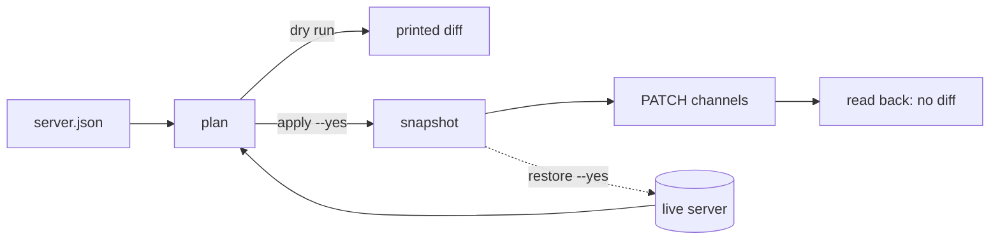

# OpenDrone Discord

Configuration as code for the [OpenDrone Discord server](https://discord.gg/v3sWmTcx3R).
`server.json` describes the channels this repository manages and who can see and
use them; `discord_config.py` compares it with the live server and applies the
difference.



## Rules

| Rule | Effect |
|---|---|
| Only listed channels are managed | Anything not in `server.json` is reported as unmanaged and never touched |
| Nothing is deleted | Channels are changed in place; retiring one is an archive, done by hand |
| Snapshot before every apply | `snapshots/` (git-ignored) holds the full channel, role and onboarding state |
| Read back after every apply | `apply` fails if the server still differs from `server.json` |
| Member overwrites are kept | Only role overwrites are managed |

## `server.json`

| Key | Meaning |
|---|---|
| `guild_id` | The server |
| `profiles` | Named sets of role overwrites: `{role name: {allow: [...], deny: [...]}}`. Permission names are Discord's flag names |
| `categories[]` | `id`, `name`, `access` (a profile or an inline overwrite set) and `channels[]` |
| `channels[]` | `id`, `name`, optional `topic`, optional `access`; without `access` a channel gets its category's |

Roles are referenced by name; the tool refuses to run if two roles share a name.

## Use

The bot token is read from `OPENDRONE_DISCORD_BOT_TOKEN` in the environment or in
`~/.config/incutec/credentials.env`. Python 3.10+, standard library only.

```sh
python3 discord_config.py plan              # what would change
python3 discord_config.py apply             # same, as a dry run
python3 discord_config.py apply --yes       # snapshot, apply, read back
python3 discord_config.py audit             # snapshot only
python3 discord_config.py restore snapshots/<file>.json --yes
```

Changes show up in the server's audit log with the reason
`OpenDrone-hw/discord discord_config.py`.

## Bot

The `OpenDrone Dev` application is private (only its owner can install it). It
needs its role above every role it assigns and Administrator while the layout is
being built.

## Licence

MIT
