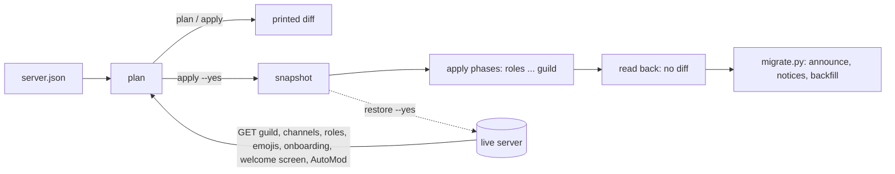
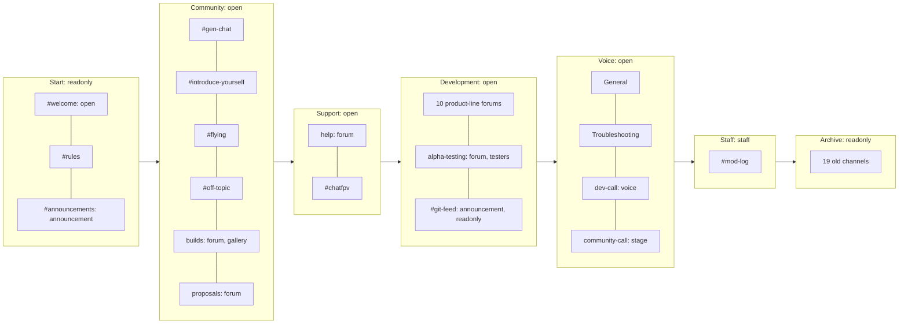
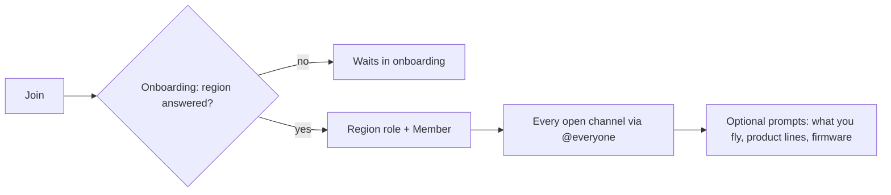
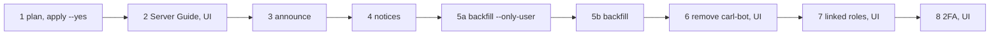

# OpenDrone Discord

Configuration as code for the [OpenDrone Discord server](https://discord.gg/v3sWmTcx3R).

| Part | What it is | Guide |
|---|---|---|
| `server.json` + `discord_config.py` | Channels, categories, forums, roles, order, archive, onboarding, welcome screen, AutoMod and guild settings, planned and applied from Git | [Commands](#commands), [`server.json`](#serverjson) |
| `migrate.py` | One-off member-facing steps after the layout is applied: announcement, archive notices, ping-role backfill, manual checklist | [Migration](#migration-migratepy) |
| `bot/` | Cloudflare Worker bot: GitHub activity into Discord, KiCad collision guard, commands, linked roles | [bot/README.md](bot/README.md) |



## Target layout

This is what `server.json` describes. `discord_config.py plan` shows how far the
live server is from it; nothing of it is live until `apply --yes` runs.



| Category | Channel | Type | Access | Onboarding default | Onboarding option that adds it |
|---|---|---|---|---|---|
| Start | welcome | text | open | yes | |
| Start | rules | text | readonly | yes | |
| Start | announcements | announcement | readonly | yes | |
| Community | gen-chat, introduce-yourself, flying, off-topic | text | open | yes | |
| Community | builds | forum, gallery, sorted by creation | open | yes | |
| Community | proposals | forum | open | | Proposals |
| Support | help | forum | open | yes | |
| Support | chatfpv | text | open | | |
| Development | flight-controllers, escs, receivers, video, remote-id-gps, frames, power, library, web-and-tools | forum | open | | the product line, see [Onboarding](#onboarding) |
| Development | firmware | forum | open | | Betaflight, AM32, ExpressLRS |
| Development | alpha-testing | forum | testers | | Alpha testing |
| Development | git-feed | announcement | readonly | | |
| Voice | General, Troubleshooting | voice (kept as live) | open | | |
| Voice | dev-call | voice | open | | |
| Voice | community-call | stage | open | | |
| Staff | mod-log | text | staff | | |
| Hardware, Software | none (emptied) | category | readonly | | |
| Archive | 19 old channels, see [Migration](#migration-migratepy) | as live | readonly | | |

`#web-support` and `#web-support-admin` belong to the storefront support bot:
they are `guard.protected_channels`, so the tool refuses any plan that manages
or archives them, and they are reported as unmanaged. Hardware and Software stay
as empty read-only categories because the tool never deletes and categories
cannot be archived.

### Forums

| Forum | Tags | Tag required |
|---|---|---|
| Product-line forums (10) | Products of that line (the repositories `bot/config/repos.json` maps there), lifecycle `planned`, `in progress`, `alpha`, `beta`, `launched` (moderated), work type `schematic`, `layout`, `bom`, `firmware`, `question`, `bug` | Yes |
| help | Product line, `question`, `bug`, `solved` | Yes |
| proposals | Product line, `idea`, `spec`, `accepted` and `declined` (moderated) | Yes |
| builds | What you fly (custom emojis), product line | No |
| alpha-testing | Product line, `report`, `bug`, `fixed` (moderated) | Yes |

Moderated tags can only be set by members with Manage Threads. The bot sets the
product and lifecycle tags on the posts it creates. A test checks that every
repository in `bot/config/repos.json` has its product tag and every lifecycle
tag in its forum.

### Access profiles

| Profile | `@everyone` | Other roles |
|---|---|---|
| `open` | View, send, history, reactions, attach, embed, create public threads, send in threads, use application commands; deny `MENTION_EVERYONE` | none |
| `readonly` | View, history, reactions; deny send, create threads, send in threads | `admin` and `OpenDrone Dev` post (the bot may also pin) |
| `staff` | Deny view | `admin`, `Support` and `OpenDrone Dev` see and post |
| `testers` | View, history, reactions, attach, embed, send in threads, use application commands; deny send (in a forum: create posts) and `MENTION_EVERYONE` | `beta tester`, `developer`, `admin` create posts |

No profile names `Newbie` or `Member`, so `apply --yes` removes their
overwrites from every managed and archived channel.

## Gating model A

Discord Onboarding is the gate. A new member cannot read or post until they
answer the required prompt "Where are you from?". Every managed community
channel then grants `@everyone` directly.



| Question | Answer |
|---|---|
| Why not gate with roles? | 414 of 507 members hold `Newbie` (carl-bot gives it on join). A `Newbie` deny left on any channel locks all of them out, and a channel only `Member` unlocks hides it from everyone without `Member` |
| What happens to `Newbie` and `Member`? | Both roles stay; they are never deleted. No channel overwrite uses them. The region options still give `Member`, and the bot's member-only commands (`/link`, To GitHub issue) read it. Nothing gives `Newbie` once carl-bot is removed |
| What enforces it? | `guard.gating_roles` is `["Newbie", "Member"]`: the [lockout guard](#lockout-guard) refuses a plan in which holding any mix of them takes away a permission `@everyone` alone has. A test checks no managed channel has a `Newbie` or `Member` overwrite |
| What keeps onboarding valid? | Nine default channels, five of them text channels `@everyone` can view and send in (#welcome, #gen-chat, #introduce-yourself, #flying, #off-topic), so Discord's requirement is met without relying on how it counts forums. The tool checks this before any write, see [Onboarding requirement check](#onboarding-requirement-check) |

## Onboarding

Mode `advanced`. Onboarding replaces the carl-bot reaction roles in #roles;
members change their answers later in Channels & Roles (`<id:customize>`).

| Prompt | Required | Options: roles given | Channels added |
|---|---|---|---|
| Where are you from? | Yes, single select | North America, Europe, Asia, South America, Oceania, Africa: that region role and `Member` | none |
| What do you fly? | No | Plane, Camera, FPV, Tinywhoop, Racing, Freestyle, Commercial, Long Range, Cinewhoop, Toothpick (custom server emojis): the role of the same name | none |
| Follow OpenDrone development | No | Flight controllers: `FC dev`; ESCs: `ESC dev`; Receivers: `RX dev`; Video: `Video dev`; Remote ID and GPS: `RemoteID-GPS dev`; Frames: `Frame dev`; Power: `Power dev`; KiCad library: `Library dev`; Web and tools: `Web-Tools dev`; Proposals and Alpha testing: no role | The matching forum |
| Firmware | No | Betaflight, AM32, ExpressLRS: the role of the same name | firmware |

Default channels: #welcome, #rules, #announcements, #gen-chat,
#introduce-yourself, #off-topic, #flying, help, builds. The development forums
are opt-in only. Welcome screen: #rules, #announcements, help, builds,
#gen-chat.

## Roles

`server.json` creates or updates these; every other role is left alone.

| Role | Given by | Onboarding may give it |
|---|---|---|
| `Maintainer` (hoisted) | Linked role: `maintainer` is true, see [bot/README.md](bot/README.md#linked-role-metadata) | No |
| `Contributor` (hoisted) | Linked role: `merged_prs` at least 1 | No |
| `Verified Owner` | Linked role: `owner` is true. Owner means any paid order on opendrone.be, preorders included; the storefront fills it, until then it is 0 for everyone | No |
| `Verified Builder` | The bot's Approve build message command (reviewer or admin) | No |
| `FC dev`, `ESC dev`, `RX dev`, `Video dev`, `RemoteID-GPS dev`, `Frame dev`, `Power dev`, `Library dev`, `Web-Tools dev` | Onboarding "Follow OpenDrone development"; `migrate.py backfill` | Yes |

None of them has a permission. `guard.unassignable_roles` lists `developer`,
`beta tester`, `reviewer`, `Support`, `Maintainer`, `Contributor`,
`Verified Owner` and `Verified Builder`, so no onboarding option can hand them out.

## AutoMod

| Rule | Trigger | Actions |
|---|---|---|
| Block Mention Spam (live rule, updated) | At most 5 mentions per message, raid protection on | Block, alert in #mod-log |
| Block Harmful Words | Keyword presets profanity, sexual content, slurs | Block |
| Block Spam | Spam | Block |
| Block Invite Links | Invite link patterns, except `discord.gg/v3sWmTcx3R` | Block with a message, alert in #mod-log |

Every rule exempts `admin`, `Support`, `developer`, the `OpenDrone Support` and
`OpenBrain` bot roles, and the two storefront support channels. Guild settings:
rules channel #rules, community updates #announcements, safety alerts #mod-log.

## Commands

The bot token is read from `OPENDRONE_DISCORD_BOT_TOKEN` in the environment, else
from `~/.config/incutec/credentials.env`. Python 3.10+, standard library only.
If Python has no CA store (python.org builds on macOS), `/etc/ssl/cert.pem` is used.

| Command | Reads | Writes |
|---|---|---|
| `python3 discord_config.py plan` | Live server | Nothing; prints the diff |
| `python3 discord_config.py plan --verbose` | Live server | Nothing; every permission and role name |
| `python3 discord_config.py apply` | Live server | Nothing; same diff, then "Dry run" when there is a change |
| `python3 discord_config.py apply --yes` | Live server | Snapshot, then phase by phase (roles, categories, channels, positions, archive, onboarding, welcome screen, AutoMod, guild) with a fresh fetch after each phase that wrote, then reads back |
| `python3 discord_config.py audit` | Live server | Snapshot only |
| `python3 discord_config.py restore snapshots/<file>.json` | Live server, the snapshot | Nothing; lists what would be restored |
| `python3 discord_config.py restore snapshots/<file>.json --yes` | Live server, the snapshot | `before-restore` snapshot, then overwrites and category of managed and archived channels, onboarding and welcome screen from the snapshot, then reads back |

"Live server" is the guild, channels, roles, emojis, onboarding, welcome screen
and AutoMod rules. In compact output, permission lists longer than 4 show the
privileged permissions by name and count the rest; identical overwrite changes
are grouped. Privileged permissions are the ones that manage the server, act on
other members or their messages, or ping everyone:

| Privileged permissions |
|---|
| `ADMINISTRATOR`, `MANAGE_GUILD`, `MANAGE_ROLES`, `MANAGE_CHANNELS`, `MANAGE_WEBHOOKS`, `MENTION_EVERYONE`, `BAN_MEMBERS`, `KICK_MEMBERS`, `MODERATE_MEMBERS`, `MANAGE_MESSAGES`, `MANAGE_THREADS`, `MANAGE_GUILD_EXPRESSIONS`, `MANAGE_EVENTS`, `MANAGE_NICKNAMES`, `MUTE_MEMBERS`, `DEAFEN_MEMBERS`, `MOVE_MEMBERS`, `VIEW_AUDIT_LOG`, `PIN_MESSAGES` |

A role create line lists the role's permissions and an update line the
added and removed ones, in the same form. A new onboarding prompt or option is
printed with the roles and channels each option gives, by name, for example
`prompt 'Where are you from?': new option 'Asia': roles [Asia, Member]`.

`--config <path>` (before the command) uses another file than `server.json`.
Every write carries the audit log reason `OpenDrone-hw/discord discord_config.py`.

## `server.json`

| Key | Meaning |
|---|---|
| `guild_id` | The server |
| `guard` | Lockout guard, see below |
| `profiles` | Named sets of role overwrites: `{role name: {allow: [...], deny: [...]}}`. Permission names are Discord's flag names (`VIEW_CHANNEL`, `SEND_MESSAGES`, ...); `@everyone` is the everyone role |
| `roles[]` | `name`, optional `color` (`#rrggbb`), `hoist`, `mentionable`, `permissions`. Missing roles are created, listed ones updated, none deleted; integration-managed roles are skipped; a change to a role at or above the bot's role is refused |
| `categories[]` | `name`, `access` (a profile or an inline overwrite set), optional `id` and `channels[]`. Without `id` a category is matched by name and created when missing. List order is category order; the archive category always comes last |
| `channels[]` | Optional `id`, `name`, optional `type` (`text`, `announcement`, `voice`, `stage`, `forum`, `media`), `topic` (forum post guidelines), `slowmode`, `bitrate`, `user_limit`, `forum`, `access`. Without `access` a channel gets its category's. With `id` and no `type` the live type is kept. Without `id` it is matched by name and type (default `text`) inside its category and created when missing; a live channel of the same name but another type is left alone and noted. Only `text` and `announcement` convert into each other. Text, announcement, forum and media names must be lowercase without spaces, the form Discord stores; other names are refused. List order is channel order |
| `forum` | `tags[]` (`name`, `emoji`, `moderated`; at most 20, live tags not listed are kept), `default_reaction`, `layout` (`list`, `gallery`), `sort` (`activity`, `creation`), `require_tag`, `post_slowmode` |
| `archive` | `category` (created when missing), optional `id` of that category, `access`, `channels[]` (ids, `Category/name` or a unique name of channels not listed under `categories`): each listed channel moves into that category and gets its access; messages stay. Categories cannot be archived |
| `onboarding` | `enabled`, `mode` (`default`, `advanced`), `default_channels[]`, `prompts[]` with `title`, `type` (`multiple_choice`, `dropdown`), `single_select`, `required`, `in_onboarding`, `options[]` (`title`, `description`, `emoji`, `roles[]`, `channels[]`). Prompts and options match by title; live ones not listed are kept |
| `welcome_screen` | `enabled`, `description`, `channels[]` (at most 5: `channel`, `description`, `emoji`) |
| `automod[]` | Rules matched by `name`: `trigger` (`keyword`, `spam`, `keyword_preset`, `mention_spam`, `member_profile`), optional `event`, `metadata`, `actions[]` (`block` with optional `message`, `alert` with `channel`, `timeout` with `seconds`, `block_interaction`), `enabled`, `exempt_roles[]`, `exempt_channels[]`. Live rules not listed are left alone; per-trigger caps are checked including them |
| `guild` | `description`, `rules_channel`, `public_updates_channel`, `system_channel`, `safety_alerts_channel` |

Only `guild_id`, `profiles` and `categories` are required; a missing optional key
leaves that part of the server unmanaged. Roles are referenced by name; the tool
refuses to run if two roles share a name. Channels are referenced by id,
`Category/name` or a unique name. An emoji is a Unicode emoji or `:name:` for a
custom server emoji. An unknown key, profile, role, permission or emoji, a
permission both allowed and denied, or a channel listed twice stops the run
before any request that writes.

### Onboarding requirement check

Discord refuses an enabled onboarding that does not have enough default
channels. The tool refuses such a plan before any write, using its own
conservative estimate of Discord's rule:

| Counted | Rule |
|---|---|
| Channels | Default channels; a category counts as its channels; `advanced` mode adds the channels options grant |
| At least 7 | Channels `@everyone` can view in the planned state |
| At least 5 | Text or announcement channels `@everyone` can view and send in; forums, media, voice and stage never count here |

| Planned onboarding change | Live `below_requirements` | Check |
|---|---|---|
| `default_channels`, `mode` or `enabled` changes, onboarding ends enabled | any | Enforced |
| Only prompts change, onboarding enabled | `true` or missing | Enforced |
| Only prompts change, onboarding enabled | `false` | Skipped; the plan prints a note with the estimate |
| Onboarding ends disabled, or nothing changes | any | Skipped |

### Lockout guard

| `guard` key | Default | Rule |
|---|---|---|
| `protected_roles` | `["admin"]` | Never denied `VIEW_CHANNEL` by any planned overwrite and never lose `ADMINISTRATOR` or `VIEW_CHANNEL`; the bot's own role is always included |
| `gating_roles` | `["Newbie", "Member"]` | Gating model A: onboarding is the gate, so holding any mix of these roles (none included) never takes a permission away; see below |
| `must_see` | `["welcome", "rules"]` | Channels every gating mix must see |
| `protected_channels` | `[]` | Ids of existing channels that are never managed or archived; a name or unknown id is refused |
| `unassignable_roles` | `[]` | Roles no onboarding option may give; each must exist or be listed in `roles` |

For each checked channel the guard works out, in the planned state, the
effective permissions of a member holding `@everyone` plus each mix of gating
roles (`@everyone` alone, `+ Newbie`, `+ Member`, `+ Newbie + Member`):

| Channel | Checked | Rule |
|---|---|---|
| `must_see` channel, onboarding default channel, default category | Always | Every mix can view it |
| Channel inside a default category, any category or channel managed or archived by `server.json` | Unless no mix can view it (staff and private channels) | Every mix can view it |
| All of the above | As above | Every mix keeps every permission `@everyone` alone has there |

So any leftover `Newbie` or `Member` deny that removes a permission `@everyone`
alone has (`VIEW_CHANNEL`, `SEND_MESSAGES`, `READ_MESSAGE_HISTORY`,
`SEND_MESSAGES_IN_THREADS`, or any other bit) is a violation, and so is a
channel only `Member` unlocks (`@everyone` denied `VIEW_CHANNEL`, `Member`
allowed), because a member without `Member` cannot see it. A channel no mix can
view is skipped as a staff or private channel. A violation is refused when the
channel is managed or archived by `server.json`, when the plan changes a gating
role's permissions, or, for default channels, when the plan changes onboarding.
A violation in an unmanaged channel the plan does not change is printed as a
note instead.

Onboarding options give their roles to any member who picks them. Every option
in the planned onboarding, listed or kept from the live server, is refused when
a role it gives is:

| Role | Example |
|---|---|
| `@everyone` | |
| A `protected_roles` role or the bot's role | `admin`, `OpenDrone Dev` |
| Managed by an integration | `carl-bot`, `Server Booster` |
| In `unassignable_roles` | `developer`, `reviewer` |
| Holding a privileged permission (table above) after the plan | A role with `MANAGE_MESSAGES` or `MANAGE_THREADS` |

The check is strict when the plan changes onboarding or that role's
permissions; otherwise a live violation is printed as a note.

## Safety rules

| Rule | Effect |
|---|---|
| Only listed things are managed | Channels, roles, prompts, options, forum tags and AutoMod rules not in `server.json` are reported as unmanaged and never touched |
| Nothing is deleted | The REST client refuses DELETE; retiring a channel moves it to the `archive` category |
| Member overwrites are kept by apply | Only role overwrites are compared and written; `apply --yes` copies member overwrites into its PATCH unchanged |
| Snapshot before every apply | `snapshots/` (git-ignored) holds guild, channels, roles, emojis, onboarding, welcome screen and AutoMod as fetched |
| Read back after every apply | `apply --yes` fails if the server still differs from `server.json` |
| Restore | `restore --yes` saves a `before-restore` snapshot, writes the snapshot's full overwrite list (member overwrites included) and category for managed and archived channels present in the snapshot, onboarding and the welcome screen, then reads back. Names, types, topics, forum settings, positions, roles, AutoMod and guild settings are not restored, and channels created after the snapshot are left alone. A restore after the layout apply therefore puts old permissions and categories back but does not remove the new channels or roles |
| Audit log and rate limits | `X-Audit-Log-Reason` on every call; on 429 the tool waits `retry_after`, and it waits `X-RateLimit-Reset-After` when a bucket is empty; 6 attempts per request |

## Migration (`migrate.py`)

Run after `discord_config.py apply --yes`. Same token, `server.json` and REST
client (429 and bucket handling, no DELETE) as `discord_config.py`; every write
carries the audit log reason `OpenDrone-hw/discord migrate.py` and is followed
by a 0.5 s pause. Every subcommand is a dry run unless `--yes`.
`python3 migrate.py checklist` prints the steps below and the Server Guide copy.



| Step | Command or place | Done when |
|---|---|---|
| 1 Apply the layout | `python3 discord_config.py plan`, then `apply --yes` after the plan was seen | `apply` read-back reports no diff |
| 2 Paste the Server Guide copy | Server Settings, Onboarding, Server Guide (UI only). Before `announce`: the announcement links `<id:guide>`, and the live guide's first to-do, "Pick your roles", opens #roles, which `apply` archives | The guide shows the copy from `checklist` |
| 3 Announce | `python3 migrate.py announce`, then `--yes` | A rerun prints "already posted" |
| 4 Archive notices | `python3 migrate.py notices`, then `--yes` | "0 to write, 19 done, 0 blocked" |
| 5 Ping-role backfill | `python3 migrate.py backfill --only-user <your id>`, `--yes`, check that account's roles, then `backfill` and `--yes` | A second `backfill --yes` reports granted 0 for every role |
| 6 Remove carl-bot | Server Settings, Integrations, carl-bot, Kick | carl-bot gone; `Newbie` and `Member` roles still exist |
| 7 Attach linked roles | Server Settings, Roles, the role, Links, add `OpenDrone Dev`: Contributor `merged_prs` at least 1, Maintainer `maintainer` true, Verified Owner `owner` true | Each role shows its requirement |
| 8 Re-enable 2FA for moderator actions | Server Settings, Safety Setup | Only after `OpenDrone Dev` moved to a Developer Team whose owner has 2FA; the bot still writes |

carl-bot does two things, both replaced: it gives `Newbie` on join (onboarding
is the gate now) and runs the reaction roles in #roles (the onboarding prompts).

| Command | Reads | Writes with `--yes` | Rerun |
|---|---|---|---|
| `python3 migrate.py checklist` | Nothing | Nothing; prints the steps in order and the Server Guide copy | |
| `python3 migrate.py announce` | Channels, the newest 300 messages of #announcements | One message in #announcements: the reorganisation, `<id:customize>`, `<id:guide>`, help, builds, proposals, the archive is read-only | Finds its own message by the marker `opendrone-migration:announce-1` and posts nothing |
| `python3 migrate.py notices` | Channels, the newest 100 messages of each archived channel | In each of the 19 archived channels, a notice pointing to its successor, then pins it | Finds its notice by the marker `opendrone-migration:notice-1`; pins it if unpinned, else nothing |
| `python3 migrate.py backfill` | Channels, roles, message history of the archived development channels | The mapped ping role for each member who posted there in the window | `GET` each member first; members who hold the role or left are skipped |

`announce` and `notices` post with `allowed_mentions: {parse: []}`. Both refuse
`--yes` until the layout is applied (successor channels exist, old channels sit
in the archive category); their dry run then prints the text instead.

`backfill` flags: `--days N` (default 90), `--only-user <id>` (grant only to
that member; use it on one test account first), `--channel <name or id>`
(repeatable). Only default and reply messages count; bots, webhooks and system
messages do not; thread messages are not read. Message content is not needed,
only the author. Output is counts per channel and role, never user ids or
names. It refuses to grant a role that is missing, integration-managed,
protected, in `guard.unassignable_roles` or holds a privileged permission.

| Archived | Successor | Ping role granted by `backfill` |
|---|---|---|
| #fc, #aio | flight-controllers | FC dev |
| #esc | escs | ESC dev |
| #rx | receivers | RX dev |
| #vtx, #digital-vtx | video | Video dev |
| #remote-id, #gps | remote-id-gps | RemoteID-GPS dev |
| #frame | frames | Frame dev |
| #charger | power | Power dev |
| #opendrone-web | web-and-tools | Web-Tools dev |
| #esc-am32, #fc-betaflight, #rx-expresslrs | firmware | AM32, Betaflight, ExpressLRS |
| #proposals, #builds, #support | proposals, builds, help | none |
| #motors | #gen-chat (no motor product line) | none |
| #roles | Channels & Roles (`<id:customize>`) | none |

The mapping is `SUCCESSORS` in `migrate.py`, keyed by channel id. Tests check
it covers exactly `server.json`'s archive list and that each ping role is the
one the onboarding option for that successor gives. `Library dev` has no
archived predecessor, so `backfill` never grants it.

## Manual steps (Discord UI only)

These have no API, or are outside what the scripts manage.

| Step | Where | Why |
|---|---|---|
| Server Guide: welcome sign, new member to-dos, resource pages | Server Settings, Onboarding, Server Guide | Discord has no API for the Server Guide. The copy is in `migrate.py checklist` |
| Remove carl-bot | Server Settings, Integrations | `migrate.py` never deletes or kicks |
| Attach linked roles to a role | Server Settings, Roles, the role, Links | No API; the metadata comes from the bot, see [bot/README.md](bot/README.md) |
| Re-enable "Require 2FA for moderator actions" | Server Settings, Safety Setup | It is off so the bot can write. Turn it on again after the `OpenDrone Dev` application moves to a Developer Team whose owner has 2FA, then check the bot still writes |
| Command permission overrides | Server Settings, Integrations, OpenDrone Dev | Approve build and `/promote` are visible to Administrators only until an override is added |
| Bot setup: D1, GitHub App, secrets, deploy, Developer Portal, command and metadata registration | See [bot/README.md, Setup](bot/README.md#setup) | Each needs an explicit request; none runs from this repository's tests |

## Bot application

`OpenDrone Dev` (application id `1553748824470851644`) is private: only its owner
can install it. `discord_config.py` and the Worker in `bot/` use the same
application. Its role must stay above every role it assigns, and it holds
Administrator while the layout is built.

## Validation

```sh
python3 -m unittest discover -s tests       # config tool, offline
cd bot && npm ci && npm test && npx tsc --noEmit
```

## Licence

MIT
