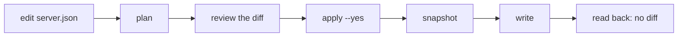

# OpenDrone Discord

Configuration as code for the [OpenDrone Discord server](https://discord.gg/v3sWmTcx3R).

| Part | What it is |
|---|---|
| `server.json` + `discord_config.py` | Channels, roles, permissions, onboarding, welcome screen, AutoMod and guild settings, planned and applied from Git |
| `texts.py` | Posts the bot-owned texts: #rules, #welcome, the Server Guide resource pages and one hub message per repository |
| `bot/` | Cloudflare Worker: pull request threads, `#git-feed`, KiCad collision guard, commands, linked roles. See [bot/README.md](bot/README.md) |

## Change the server



```sh
python3 discord_config.py plan          # diff against the live server, writes nothing
python3 discord_config.py apply --yes   # snapshot, apply, read back
python3 discord_config.py restore snapshots/<file>.json [--yes]
```

The token comes from `OPENDRONE_DISCORD_BOT_TOKEN`, else
`~/.config/incutec/credentials.env`. Python 3.10+, standard library only.

| Rule | Effect |
|---|---|
| Only listed things are managed | Channels, roles, prompts, options, tags and AutoMod rules not in `server.json` are reported as unmanaged and left alone |
| Nothing is deleted | A channel leaves `server.json` or moves to `archive`; a person deletes it in the UI |
| Snapshot and read back | Every `apply --yes` saves `snapshots/` (git-ignored) first and fails if the server still differs afterwards |
| Lockout guard | Refuses a plan that hides a channel from `admin` or the bot, lets an onboarding option hand out a staff or privileged role, or breaks Discord's onboarding minimum (7 default channels, 5 writable) |

## Layout

```mermaid
flowchart LR
  subgraph Start
    s1["#welcome, #rules, #announcements"]
  end
  subgraph Community
    c1["#gen-chat, #introduce-yourself, #flying, #off-topic, #builds, #proposals"]
  end
  subgraph Support
    h1["help (forum), #chatfpv"]
  end
  subgraph Development
    d1["#git-feed (GitHub feed role), alpha-testing (testers)"]
  end
  subgraph Hardware
    hw["one channel per product line"]
  end
  subgraph Software
    sw["#fc-betaflight, #esc-am32, #rx-expresslrs, #opendrone-web"]
  end
  subgraph Voice
    v1["general, troubleshooting, dev-call, community-call"]
  end
  subgraph Staff
    st["#mod-log, #web-support, #web-support-admin"]
  end
  Start --> Community --> Support --> Development --> Hardware --> Software --> Voice --> Staff
```



| What a member sees | How |
|---|---|
| Start, Community, help, Voice | Onboarding defaults |
| A product or firmware channel | Picking it in onboarding or Channels & Roles |
| #git-feed | Picking GitHub feed, which gives the `GitHub feed` role |
| alpha-testing | `beta tester`, given by an admin with an alpha board |
| Staff | `admin`, `Support`, the bot |

Four read-only channels (#how-to-contribute, #product-lifecycle,
#buying-and-support, #licence-and-ai) are the Server Guide resource pages and
are not in the sidebar. `#web-support` (storefront tickets) and
`#web-support-admin` belong to the storefront support bot: they are
`guard.protected_channels`, so no plan touches them.

Access profiles in `server.json`: `open` (everyone reads and writes),
`readonly` (admin and the bot post), `staff`, `testers` and `feed` (hidden
except for their roles). No profile uses `Newbie` or `Member`: onboarding is the
gate, and the region answer gives `Member`.

## Onboarding and roles

| Prompt | Gives |
|---|---|
| Where are you from? (required) | Region role and `Member` |
| What do you fly? | The role of the same name |
| Follow OpenDrone development | `FC follower` ... `Web-Tools follower` and their channels; `GitHub feed`; #proposals |
| Which firmware do you use? | `Betaflight user`, `AM32 user`, `ExpressLRS user` and their channels |

| Role | Given by |
|---|---|
| `Contributor` | Linked role: 1 or more merged PRs in OpenDrone-hw |
| `Maintainer` | Linked role: member of the GitHub team `core` |
| `Verified Owner` | Linked role: an order on opendrone.be (the storefront does not report it yet) |
| `Verified Builder` | The bot's Approve build command |
| `Support` | Moderators; the only managed role with permissions |
| `Betaflight`, `AM32`, `ExpressLRS` | By hand, for those projects' maintainers |

## `server.json` keys

| Key | Holds |
|---|---|
| `guard` | `protected_roles`, `gating_roles`, `must_see`, `protected_channels`, `unassignable_roles` |
| `profiles` | Named overwrite sets: `{role: {allow: [...], deny: [...]}}` with Discord flag names |
| `roles[]` | `name`, `renamed_from`, `color`, `hoist`, `mentionable`, `permissions` |
| `categories[]` | `name`, `access`, optional `id`, `channels[]`; list order is sidebar order |
| `channels[]` | `name`, optional `id`, `type`, `topic`, `access`, `slowmode`, `forum` (`tags`, `default_reaction`, `layout`, `sort`, `require_tag`) |
| `archive` | A category and the channels moved into it |
| `onboarding` | `mode`, `default_channels`, `prompts[]` (`options[]`, `renamed_from`, `retired_options[]`) |
| `welcome_screen`, `automod[]`, `guild` | As Discord names them |

Roles are referenced by name, channels by id, `Category/name` or a unique name.
An unknown key, role, permission or emoji stops the run before any write.

## Bot-owned texts (`texts.py`)

Each subcommand is a dry run without `--yes` and edits its message in place
when the text changed; nothing is reposted or pinned twice.

| Command | Posts |
|---|---|
| `python3 texts.py resources` | #welcome and the four resource pages; texts are `RESOURCES` in `texts.py` |
| `python3 texts.py rules --rules-file <md>` | #rules, pinned |
| `python3 texts.py hubs` | One pinned hub per public repository in its product channel: link, description, lifecycle, releases |

## Discord UI only

| Task | Where |
|---|---|
| Server Guide: welcome sign, to-dos, resource pages | Server Settings > Onboarding > Server Guide |
| Linked role requirements | Server Settings > Roles > the role > Links |
| Delete a channel that left `server.json` | Right-click > Delete Channel |
| Command visibility for Approve build and `/promote` | Server Settings > Integrations > OpenDrone Dev |

The bot application `OpenDrone Dev` (id `1553826696673759344`) is used by
both the scripts and the Worker. It holds Administrator because the config tool
can only grant permissions the bot itself has.

## Validation

```sh
python3 -m unittest discover -s tests
cd bot && npm ci && npm test && npx tsc --noEmit
```

## Licence

MIT
