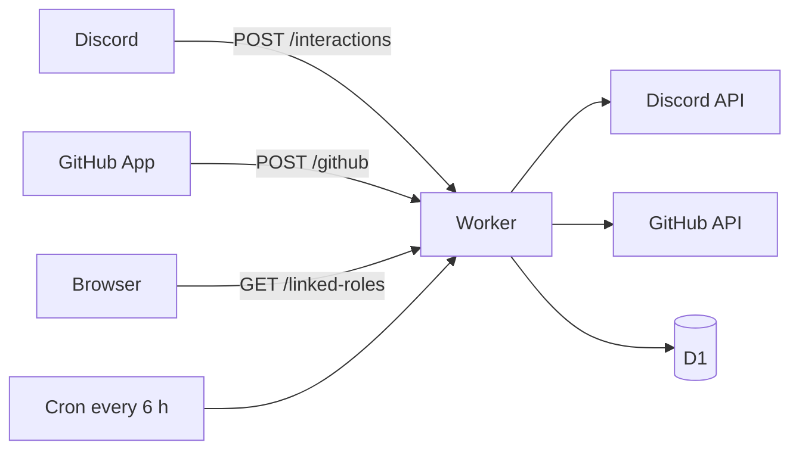

# OpenDrone Discord bot

A Cloudflare Worker that connects the Discord server to the OpenDrone-hw GitHub
organisation. It uses HTTP only (no gateway), so it receives commands, buttons
and modals but no message, reaction or member events.



## GitHub activity

A pull request in a public repository gets one thread in the product channel
`config/repos.json` maps it to. The bot writes `Discussion: <thread link>` into
the PR description, so PR and thread point at each other. Private repositories
post nothing.

| Event | PR thread | `#git-feed` | `#announcements` |
|---|---|---|---|
| PR opened, reopened, ready for review | Started if missing; card with the first paragraph of the description | Line | |
| New commits | Push line | | |
| Review submitted | Review card | Approved or changes requested | |
| Checks finished | Card for the head commit | Default-branch failures | |
| PR merged or closed | Card | Line | |
| Release published | | Line | Release card |
| `status-*` topic changed | | Line | Lifecycle card |
| Push to the default branch | | Line | |

The thread is named `<repo> #<n>: <title>`. A PR that already has a
`Discussion:` line pointing at a thread in its product channel posts there
instead of starting one.

KiCad collision guard: when two open PRs in one repository change the same
`.kicad_pcb` or `.kicad_sch` file, the bot comments on the PR and posts a
warning in both threads. KiCad files cannot be merged.

Each delivery is processed once (D1 table `github_deliveries`); a redelivery
repeats only the failed steps. Every message is sent with
`allowed_mentions: {parse: []}`: the bot never pings.

## Commands

| Command | Where | Who | Does |
|---|---|---|---|
| `/link pr:<url>` | Thread in the PR's product channel | Members | Links an existing thread to a PR |
| `/branch [repo]` | Thread in a product channel | Anyone | Fork and branch commands and the `Discussion:` line |
| `/editing repo:<name>` | Anywhere | Anyone | Open PRs that change KiCad files |
| `/verify` | Anywhere | Anyone | Link to the linked-roles page |
| `/promote` | Anywhere | Admin | New repository from `hardware-template`; off while `PROMOTE_ENABLED` is `"false"` |
| To GitHub issue | Message in a product thread | Members | Issue with a link back to the message |
| Approve build | Message | Reviewer, admin | Gives the author `Verified Builder` |

Members are holders of `Member` (given by the onboarding region answer),
`admin`, `developer`, `reviewer` or `beta tester`.

## Linked roles

`/verify` links a Discord account to a GitHub login. The Worker pushes:

| Key | Source | Role |
|---|---|---|
| `merged_prs` | GitHub search of merged PRs in the organisation | `Contributor` (at least 1) |
| `maintainer` | Member of the team `GITHUB_MAINTAINER_TEAM` (`core`) | `Maintainer` |
| `org_member` | Organisation membership | |
| `owner` | `users.owner` in D1; nothing writes it yet, so 0 | `Verified Owner` |

A merge or a team change refreshes that user at once; the cron refreshes the
rest daily.

## Configuration

`config/repos.json` maps each repository to its product channel and names the
channels and roles the bot uses; ids are resolved by name at runtime.
`tests/test_server_json.py` in the parent repository checks these names match
`server.json`.

| Var in `wrangler.toml` | Value |
|---|---|
| `GUILD_ID` | `1494019459822653512` |
| `APPLICATION_ID` | `1553826696673759344` |
| `GITHUB_MAINTAINER_TEAM` | `core` |
| `PROMOTE_ENABLED` | `"false"` |

| Secret (`npx wrangler secret put <NAME>`) | Source |
|---|---|
| `DISCORD_PUBLIC_KEY`, `DISCORD_BOT_TOKEN`, `DISCORD_CLIENT_ID`, `DISCORD_CLIENT_SECRET` | Discord Developer Portal |
| `GITHUB_APP_ID`, `GITHUB_APP_PRIVATE_KEY`, `GITHUB_OAUTH_CLIENT_ID`, `GITHUB_OAUTH_CLIENT_SECRET` | GitHub App `opendrone-discord` |
| `GITHUB_WEBHOOK_SECRET` | The App's webhook secret |
| `SESSION_SECRET` | `openssl rand -base64 32`; rotating it unlinks every user |

The GitHub App has Metadata read, Pull requests and Issues read and write,
Checks and Contents read, organisation Members read, and no Administration.
It subscribes to pull request, review, check suite, release, repository, push,
organization and membership events.

The Developer Portal points the Interactions Endpoint at
`https://<worker>/interactions`, the Linked Roles Verification URL at
`https://<worker>/linked-roles`, and has the OAuth redirect
`https://<worker>/linked-roles/discord/callback`.

## Deploy

```sh
cd bot
npx wrangler deploy
npm run register-commands -- --yes    # after a command changes
npm run register-metadata -- --yes    # after a linked-role key changes
```

Both register scripts print what they would send without `--yes`.

## Check

Node 23.6 or newer.

```sh
npm ci && npm test && npx tsc --noEmit
```

Tests replace `fetch` and fail on any network access.

## Code

| Path | Content |
|---|---|
| `src/index.ts`, `src/registry.ts` | Routes and the module contract |
| `src/commands/`, `src/github/`, `src/linked-roles/` | The three modules |
| `src/discord.ts`, `src/github.ts` | API clients |
| `config/repos.json` | Repository to channel map, channel and role names |
| `migrations/` | D1 schema |

## Licence

MIT
