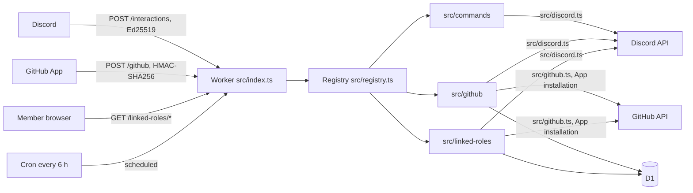
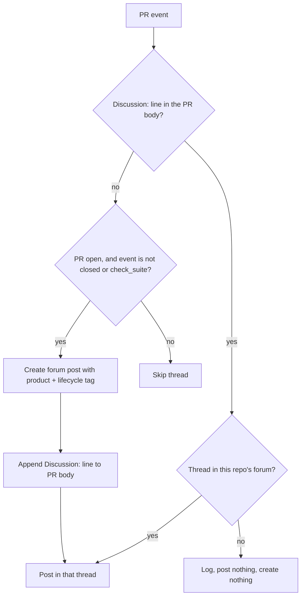
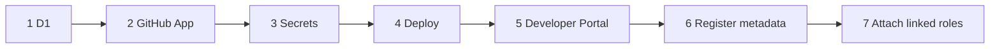

# OpenDrone Discord bot

A Cloudflare Worker that connects the OpenDrone Discord server to the
OpenDrone-hw GitHub organisation. It talks to Discord over HTTP only (no
gateway connection), so it receives interactions (commands, buttons, modals)
but no message, reaction or member events.



## Endpoints

| Route | Handler | Answer |
|---|---|---|
| `POST /interactions` | `src/interactions.ts` | 401 on a bad or missing Ed25519 signature or an interaction older than 300 s; PING gets PONG; any guild other than `GUILD_ID` gets an ephemeral refusal |
| `POST /github` | `src/webhooks.ts` | 401 on a bad `X-Hub-Signature-256`; `ping` gets 200; otherwise 202 and the matching handlers run in `ctx.waitUntil` |
| `GET /linked-roles` | `src/linked-roles/routes.ts` | 302 to Discord OAuth (`identify role_connections.write`) |
| `GET /linked-roles/discord/callback` | same | Stores the sealed Discord refresh token, 302 to GitHub OAuth |
| `GET /linked-roles/github/callback` | same | Stores the login and sealed GitHub refresh token, PUTs the role connection, 200 result page |
| `scheduled()` | every module's `scheduled` | Cron `17 */6 * * *` (`wrangler.toml`) |

Any other path is 404; a known path with the wrong method is 405.

## What each module does

| Module | Does |
|---|---|
| `src/commands/` | Slash and context-menu commands (see [Commands](#commands)); Discord shows them only after `register-commands --yes` |
| `src/github/` | Posts GitHub activity into Discord and runs the KiCad collision guard (tables below) |
| `src/linked-roles/` | Discord + GitHub OAuth, role connection metadata, D1 storage of sealed refresh tokens, cron refresh |

### GitHub events

| Event.action | Forum thread of the PR's repository | `#git-feed` | `#announcements` |
|---|---|---|---|
| `pull_request.opened`, `reopened`, `ready_for_review` | Created if missing, card | One line | No |
| `pull_request.synchronize` | Created if missing, push line | No | No |
| `pull_request.closed` | Card if linked (merged or closed) | One line | No |
| `pull_request_review.submitted` | Created if missing, review card | Approved or changes requested | No |
| `check_suite.completed` | Card if linked, only for the PR head commit | Default-branch failures only | No |
| `release.published` | No | One line | Release card with up to 10 asset links |
| `repository.edited` (`changes.topics`) | No | One line | When the `status-*` topic changes |
| `push` | No | Default branch only, not PR merges | No |
| `organization.member_added`, `member_removed` | No | No | No |
| `membership.added`, `removed` (team) | No | No | No |

`pull_request.closed` with `merged: true`, `organization.member_added` and
`member_removed`, and team `membership.added` and `removed` also refresh the
affected user's linked-role metadata (see [Linked-role metadata](#linked-role-metadata)).

Private repositories post nothing to Discord; the collision guard still comments
on their pull requests.

### PR to thread link



The line is `Discussion: https://discord.com/channels/<guild>/<thread>`. It is
the only record of the link; nothing about it is stored in D1.

### KiCad collision guard

On `pull_request` opened, reopened, ready_for_review and synchronize, the PR's
`.kicad_pcb` and `.kicad_sch` files are compared with up to 25 other open PRs in
the same repository. For each overlapping pair the bot posts one PR comment on
the triggering PR and a warning card in both PRs' threads. A hidden marker in
the comment records the pair and files, so a pair is warned again only when a
new file overlaps.

### Idempotency

Every visible step (forum post, card, feed line) runs once per
`X-GitHub-Delivery` through the D1 table `github_deliveries`, created on first
use and pruned after 7 days by the cron. A redelivery repeats only the steps
that failed.

### Linked-role metadata

| Key | Type | Source |
|---|---|---|
| `merged_prs` | Integer, greater than or equal | GitHub search `is:pr is:merged org:OpenDrone-hw author:<login>` |
| `org_member` | Boolean | `GET /orgs/OpenDrone-hw/members/<login>` |
| `maintainer` | Boolean | Active member of the team `GITHUB_MAINTAINER_TEAM` (default `maintainers`) |
| `owner` | Boolean | `users.owner` in D1; nothing in this repository writes it, so it is 0 |

The cron refreshes 6 users per run whose last refresh is older than 24 h, oldest
first (4 runs a day, at most 24 users a day). A per-user lease in D1 serialises
overlapping refreshes of one user.

Discord re-evaluates linked roles only when the bot pushes new metadata, so
these webhook events push it at once for the GitHub login they concern
(`src/github/linked-roles.ts`, calling `refreshLinkedUser`):

| Event.action | Login refreshed |
|---|---|
| `pull_request.closed` with `merged: true` | The PR author |
| `organization.member_added`, `member_removed` | `membership.user` |
| `membership.added`, `removed`, scope `team` | `member` |

Only events of the `config/repos.json` organisation count, and bot logins such
as `dependabot[bot]` are skipped. The refresh runs as its own handler in
`ctx.waitUntil`, next to the posting handlers, so the 202 reply and the Discord
cards never wait for it. A failed refresh is logged and the webhook carries on;
a refresh still running after 25 s is logged as unfinished, before Cloudflare
cancels it at 30 s. A login nobody linked is a D1 lookup and nothing else. A
user whose webhook refresh failed is refreshed by the cron once their last
refresh is older than 24 h.

`merged_prs` comes from GitHub search, which indexes a merge asynchronously and
can still return the pre-merge count when the refresh runs a second after the
webhook. The merge refresh therefore passes a lower bound of 1
(`refreshLinkedUser(services, login, options, { minMergedPrs: 1 })`): the
pushed value is `max(search count, 1)`, so a first merged pull request moves
`merged_prs` from 0 to 1 at once. The bound applies only while the Discord user
is still linked to that login; after a GitHub unlink or rename the search count
stands. For an author who already had merged PRs the count can stay one short
until their next refresh.

## Behaviour every module inherits

| Rule | Where |
|---|---|
| Every message the bot sends carries `allowed_mentions: {parse: []}` unless the caller sets `allowed_mentions` explicitly | `src/discord.ts`, `src/interactions.ts` |
| On 429 the client waits `retry_after` and retries (3 times); rate-limit waits share a 5 s budget per call, beyond it the call throws `RateLimitError` | `src/discord.ts` |
| Tokens in `/webhooks/{id}/{token}` and `/interactions/{id}/{token}` paths are redacted from errors | `src/discord.ts` |
| Mutating Discord calls carry the audit log reason `OpenDrone-hw/discord bot` unless given another | `src/discord.ts` |
| A failing GitHub handler is logged and does not stop the others | `src/webhooks.ts` |
| `defer()` work and GitHub handlers run in `ctx.waitUntil`, which Cloudflare cancels 30 s after the response | `src/interactions.ts`, `src/webhooks.ts` |
| Channel, role and tag ids are resolved by name at runtime; no id is hard-coded | `src/config.ts` |
| A module conflict (same command, custom_id prefix or route) fails at startup | `src/registry.ts` |

## Commands

All are guild-only. Role checks run in the Worker; `default_member_permissions`
only decides who sees a command until an override is added in Server
Settings, Integrations, OpenDrone Dev. Staff means admin or developer.

| Command | Where | Who | What it does |
|---|---|---|---|
| `/link pr:<url>` | thread of the forum the PR's repository maps to | members; private repos: refused | Writes `Discussion: <thread url>` into the PR description; a repository of another forum is refused before any GitHub call. Replaces an existing line only when it points at a post the bot created or at a deleted thread, and leaves a "moved to" note in the replaced post |
| `/branch [repo]` | development forum thread | anyone who can use it | Fork and branch commands, and the `Discussion:` line to put in the PR description. `repo` accepts and autocompletes only repositories mapped to the thread's forum (tagged ones first) |
| `/editing repo:<name>` | anywhere | anyone; private repos: staff | Open PRs that change `.kicad_pcb` or `.kicad_sch` files |
| `/verify` | anywhere | anyone who can use it | Link to the Linked Roles verification page |
| `/promote name summary [private]` | anywhere | admin | Creates a repository from `hardware-template` with topic `status-planned`. Refuses while `PROMOTE_ENABLED` is `"false"` |
| To GitHub issue | message in a development forum thread | members; private repos: staff | Modal, then an issue with a link back to the message |
| Approve build | message | reviewer or admin | Grants Verified Builder to the message author |

Approve build and `/promote` are visible to Administrators only until an
override is added.

The GitHub module follows a `Discussion:` line only to a thread in the
repository's own forum (`linkState` in `src/github/thread-link.ts`), so
`/link` and `/branch` refuse any other repository instead of writing or
handing out a line it would ignore.

## `config/repos.json`

| Key | Meaning |
|---|---|
| `org` | GitHub organisation; repositories outside it are ignored |
| `channels` | `gitFeed`, `announcements`, `modLog`: channel names |
| `roles` | Role names by key (`admin`, `reviewer`, `verifiedBuilder`, ...) |
| `lifecycleTags` | `status-*` repository topic to forum tag name |
| `forums` | The development forum names |
| `repos` | Repository name to `{forum, tag}`; `tag` is the product tag in that forum |

Loading fails if a repository points at a forum not in `forums`, a tag repeats
within a forum, a tag is longer than 20 characters, or a forum's product and
lifecycle tags exceed Discord's 20.

### Server prerequisites

The names in `config/repos.json` must exist on the server; `server.json` on this
branch does not create them.

| Missing on the server | Effect |
|---|---|
| A channel in `channels` | The message is logged and dropped |
| A forum in `forums` | Thread creation for that repository fails and is logged |
| A product tag | The post is created without it, with a warning in the log |
| A lifecycle tag | The post is created without it |

## Layout

| Path | Content |
|---|---|
| `src/index.ts` | Entry point and route table |
| `src/registry.ts` | The `BotModule` contract, dispatch rules and time budgets |
| `src/interactions.ts` | `POST /interactions` and the reply helpers `messageResponse`, `ephemeral`, `defer` |
| `src/webhooks.ts` | `POST /github` |
| `src/verify.ts` | Ed25519 and HMAC-SHA256 checks |
| `src/discord.ts` | Discord REST client |
| `src/github.ts` | GitHub App client: RS256 JWT via WebCrypto, installation token cache |
| `src/config.ts` | `config/repos.json` validation, `findRepo`, `Directory` (name to id, cached per isolate) |
| `src/services.ts` | Per-request bundle of env, clients and directory |
| `src/commands/` | Commands; table at the top of `src/commands/index.ts` |
| `src/github/` | Webhook handlers; file table at the top of `src/github/index.ts` |
| `src/linked-roles/` | Linked roles; file table at the top of `src/linked-roles/index.ts` |
| `config/repos.json` | Repository to forum and product tag, channel and role names |
| `migrations/` | D1 schema for `users` |
| `scripts/` | `register-commands.ts`, `register-metadata.ts` |
| `test/` | vitest suites, offline |

## Check

Node 23.6 or newer (the scripts run TypeScript directly).

```sh
cd bot
npm ci
npm test            # vitest run
npx tsc --noEmit
```

Tests replace `fetch` and fail on any network access.

## Setup

Replace `<worker>` below with the Worker's URL, for example
`opendrone-discord-bot.<account>.workers.dev`. Every step is manual.



### 1. D1 database

```sh
npx wrangler d1 create opendrone-discord-bot
# put the printed database_id into wrangler.toml
npx wrangler d1 migrations apply opendrone-discord-bot --remote
```

### 2. GitHub App

GitHub: organisation OpenDrone-hw, Settings, Developer settings, GitHub Apps,
New GitHub App.

| Setting | Value |
|---|---|
| Callback URL | `https://<worker>/linked-roles/github/callback` |
| Expire user authorization tokens | On (issues refresh tokens) |
| Request user authorization (OAuth) during installation | Off |
| Webhook | Active, URL `https://<worker>/github`, secret = `GITHUB_WEBHOOK_SECRET` |
| Where can this GitHub App be installed | Only on this account |

These are the permissions and events the merged code uses. Grant nothing more.

| Repository permission | Access | Used for |
|---|---|---|
| Metadata | Read | Required; the repository event; the `private` flag read by `/editing` and "To GitHub issue" |
| Pull requests | Read and write | Read PRs and their files, list open PRs, append the `Discussion:` line to a PR body (webhooks and `/link`), post the collision comment (issue comments API on a PR), `/editing` |
| Issues | Read and write | "To GitHub issue" creates the issue |
| Checks | Read | `check_suite` events |
| Contents | Read | `push` and `release` events |
| Administration | No access | Only `/promote` needs it (see below). Without it the App cannot create, delete, rename or transfer repositories or change settings and branch protection |

| Organization permission | Access | Used for |
|---|---|---|
| Members | Read | `org_member` and `maintainer` linked-role metadata; required to subscribe to the Organization and Membership events |

| Webhook event | Actions handled |
|---|---|
| Pull request | opened, reopened, ready_for_review, synchronize, closed (a merge also refreshes the author's linked roles) |
| Pull request review | submitted |
| Check suite | completed |
| Release | published |
| Repository | edited (only `changes.topics` is read) |
| Push | every push; only the default branch is posted |
| Organization | member_added, member_removed (linked-role refresh) |
| Membership | added, removed (team membership; linked-role refresh) |

`/promote` is implemented but disabled: `PROMOTE_ENABLED` is `"false"` in
`wrangler.toml`, and the command then refuses before any GitHub call. Enabling
it needs `PROMOTE_ENABLED = "true"` and "Administration: Read and write" on the
App, which is why Administration stays at No access until then. Setting the
`status-planned` topic also needs the new repository to be inside the App
installation, so install the App on all repositories of the organisation.

After creating it: generate a private key and a client secret, then install the
App on OpenDrone-hw. The private key can stay in the PKCS#1 form GitHub issues;
the Worker converts it.

### Discord permissions of the bot role

View Channels, Send Messages, Send Messages in Threads and Create Public Threads
(forum posts) in the development forums, `#git-feed` and `#announcements`.
Approve build also needs Manage Roles, with the bot's role above Verified Builder.

### 3. Secrets

`npx wrangler secret put <NAME>` for each; it prompts for the value.

| Name | Source |
|---|---|
| `DISCORD_PUBLIC_KEY` | Developer Portal, General Information, Public Key |
| `DISCORD_BOT_TOKEN` | Developer Portal, Bot, token |
| `DISCORD_CLIENT_ID` | Developer Portal, OAuth2, Client ID |
| `DISCORD_CLIENT_SECRET` | Developer Portal, OAuth2, Client Secret |
| `GITHUB_APP_ID` | GitHub App page, App ID |
| `GITHUB_APP_PRIVATE_KEY` | The downloaded `.pem`: `npx wrangler secret put GITHUB_APP_PRIVATE_KEY < key.pem` |
| `GITHUB_WEBHOOK_SECRET` | The webhook secret chosen in step 2 |
| `GITHUB_OAUTH_CLIENT_ID` | GitHub App page, Client ID |
| `GITHUB_OAUTH_CLIENT_SECRET` | GitHub App page, generated client secret |
| `SESSION_SECRET` | `openssl rand -base64 32`; seals refresh tokens and the session cookie. Rotating it makes stored tokens unreadable: those users must link again |

| Var (`wrangler.toml`) | Value |
|---|---|
| `GUILD_ID` | `1494019459822653512` |
| `APPLICATION_ID` | `1553748824470851644` |
| `PROMOTE_ENABLED` | `"false"`; `/promote` refuses unless it is `"true"` |
| `GITHUB_MAINTAINER_TEAM` | Optional team slug for `maintainer`; unset means `maintainers`. The team must exist, otherwise `maintainer` is 0 for everyone |

For `npm run dev`, copy `.dev.vars.example` to `.dev.vars` (git-ignored).

### 4. Deploy

```sh
npx wrangler deploy
```

### 5. Discord Developer Portal

Application `OpenDrone Dev` (1553748824470851644).

| Page | Field | Value |
|---|---|---|
| General Information | Interactions Endpoint URL | `https://<worker>/interactions` |
| General Information | Linked Roles Verification URL | `https://<worker>/linked-roles` |
| OAuth2 | Redirects | `https://<worker>/linked-roles/discord/callback` |

Discord checks the endpoint on save with a PING and a request with a bad
signature, so the Worker must be deployed with `DISCORD_PUBLIC_KEY` first.
With an endpoint URL set, all of this application's interactions go to the
Worker; a gateway process on the same application stops receiving them.

### 6. Register metadata (and commands)

Both scripts print what they would send and stop; `--yes` sends it. Each
replaces the whole list on Discord, so an empty list is refused.
`register-metadata` also refuses a schema Discord would reject, and
`--dry-run` wins over `--yes`. They read `APPLICATION_ID` and `GUILD_ID` from
the environment or `wrangler.toml`, and the token from `DISCORD_BOT_TOKEN`,
else `OPENDRONE_DISCORD_BOT_TOKEN` from the environment or
`~/.config/incutec/credentials.env`. The token is never printed.

`register-commands -- --dry-run` prints only the JSON body and cannot be
combined with `--yes`. A command without `default_member_permissions` or the
guild-only context is refused.

```sh
npm run register-metadata
npm run register-metadata -- --yes
npm run register-commands
npm run register-commands -- --dry-run
npm run register-commands -- --yes
```

### 7. Attach linked roles

Discord: Server Settings, Roles, the role, Links, add `OpenDrone Dev` and set
its requirements. This has no API.

## Not implemented

| Item | State in this branch |
|---|---|
| Metadata refresh on GitHub events | `refreshLinkedUser(services, login)` exists in `src/linked-roles/index.ts`; `src/github/` does not call it. Refresh happens only in the browser flow and the cron |
| `owner` metadata | Always 0: nothing writes `users.owner` |
| `status`, `organization`, `membership` webhooks | No handler; do not subscribe |
| Message, reaction and member events | Need a gateway connection; the Worker has none |
| Work longer than 30 s | No Cloudflare Queue is configured; only the cron (15 min per invocation) runs longer |
| `channels.modLog` in `config/repos.json` | Validated and resolvable, used by no handler; `roles` is read by the commands' role checks |

## Adding to a module

Each module's `index.ts` exports one `BotModule`; the contract, the dispatch
table and the time budgets are documented in `src/registry.ts`. `src/commands/`
is a complete example of commands, autocomplete and a modal component.

## Licence

MIT, as the rest of the repository.
