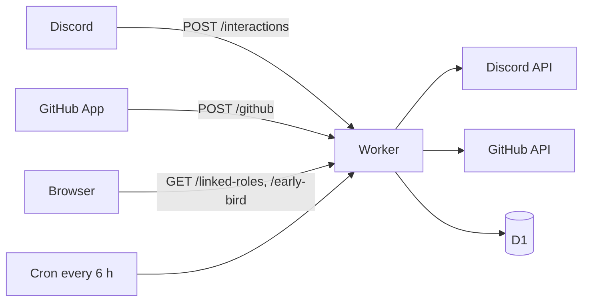

# OpenDrone Discord bot

A Cloudflare Worker that connects the Discord server to the OpenDrone-hw GitHub
organisation. It uses HTTP only (no gateway), so it receives commands, buttons
and modals but no message, reaction or member events.



## GitHub activity

A pull request or issue in a public repository gets one thread in the
product channel `config/repos.json` maps it to. Private repositories post
nothing; a payload without the `private` flag counts as private. The bot
never posts to `#announcements`: people write that channel.

| Event | Thread | Product channel | `#git-feed` |
|---|---|---|---|
| PR opened, reopened, ready for review | PR thread started if missing; card with the first paragraph of the description | Starter line | Line |
| New commits | Push line in the PR thread | | |
| Review submitted | Review card | | Approved or changes requested |
| Checks finished | Card for the head commit | | Default-branch failures |
| PR merged or closed | Card | | Line |
| Issue opened | Issue thread started; card with the first paragraph | Starter line | Line |
| Issue reopened | Card (thread started if missing) | | |
| Issue comment | One line: author, first 300 characters, link. Bot comments and comments on PRs post nothing | | |
| Issue closed | Close card, then the thread is archived | | Line |
| Release published | | Release card | Line |
| `status-*` topic changed | | Lifecycle card | Line |
| Push to the default branch | | | Line |

A PR thread is named `<repo> #<n>: <title>`. A PR that already has a
`Discussion:` line pointing at a thread in its product channel posts there
instead of starting one. An issue thread is named `<repo> issue #<n>: <title>`;
the link lives in D1 (`github_issues`), not in the issue. A comment on an open
issue without a thread starts one. Threads auto-archive after a week, the
longest Discord allows; the cron unarchives the thread of every issue that is
still open, without posting.

KiCad collision guard: when two open PRs in one repository change the same
`.kicad_pcb` or `.kicad_sch` file, the bot comments on the PR and posts a
warning in both threads. KiCad files cannot be merged.

Each delivery is processed once (D1 table `github_deliveries`); a redelivery
repeats only the failed steps. Every message is sent with
`allowed_mentions: {parse: []}`: the bot never pings.

### Kill switch

Posting from GitHub to Discord is off when either switch says off. Both are
read on every delivery; neither needs a code deploy. The secret works when D1
does not.

| Switch | Off | On again |
|---|---|---|
| `/posting state:off` in Discord (admins) | Stored in D1 `bot_settings` | `/posting state:on` |
| Worker secret `DISCORD_POSTING` (from `bot/`) | `printf off \| npx wrangler secret put DISCORD_POSTING` | `npx wrangler secret delete DISCORD_POSTING` |

`/posting` with no option shows both. While off, every delivery still gets
202 and is recorded as skipped in `github_deliveries`; a redelivery after
switching on posts it. The KiCad guard still comments on GitHub, issue states
stay current in D1, and the linked-role refresh keeps running. The cron does
not unarchive threads while off.

## Commands

| Command | Where | Who | Does |
|---|---|---|---|
| `/link pr:<url>` | Thread in the PR's product channel | Members | Links an existing thread to a PR |
| `/branch [repo]` | Thread in a product channel | Anyone | Fork and branch commands and the `Discussion:` line |
| `/editing repo:<name>` | Anywhere | Anyone | Open PRs that change KiCad files |
| `/verify` | Anywhere | Anyone | Link to the linked-roles page |
| `/promote` | Anywhere | Admin | New repository from `hardware-template`; off while `PROMOTE_ENABLED` is `"false"` |
| `/posting [state]` | Anywhere | Admin | Switches GitHub posting on or off, or shows the state |
| To GitHub issue | Message in a product thread | Members | Issue with a link back to the message |
| Approve build | Message | Reviewer, admin | Gives the author `Verified Builder` |

Members are holders of `Member` (given by the onboarding region answer),
`admin`, `developer`, `reviewer` or `beta tester`.

## Linked roles

`/verify` links a Discord account to a GitHub login. The Worker pushes:

| Key | Source | Role |
|---|---|---|
| `merged_prs` | GitHub search of merged PRs in the organisation | `Contributor` (at least 1) |
| `maintainer` | Member of the team `GITHUB_MAINTAINER_TEAM` (`core`) | `Maintainer` |
| `org_member` | Organisation membership | |
| `owner` | `users.owner` in D1; nothing writes it yet, so 0 | `Verified Owner` |

A merge or a team change refreshes that user at once; the cron refreshes the
rest daily.

## Early Bird

Every paid, not cancelled OpenDrone preorder placed before the preorder run
closes (2026-12-15) unlocks the `Early Bird` role and the private
`#early-birds` channel for one Discord account.

| Step | Where |
|---|---|
| Buyer proves the order: signed in on opendrone.be, or the link in the order confirmation mail | opendrone.be `/early-bird` (OpenDrone-Web) |
| Storefront checks the order in Shopify and signs a 10-minute claim token with `EARLY_BIRD_CLAIM_KEY` | opendrone.be |
| `GET /early-bird?t=<token>`: Discord authorization, scopes `identify guilds.join`, on the linked-roles callback | `src/linked-roles/early-bird.ts` |
| D1 `early_bird_claims`: the order is the primary key, so the first Discord account to claim it keeps it; that account may claim again | `migrations/0003_early_bird_claims.sql` |
| The bot adds a non-member to the server with the role, or adds the role to a member | Discord API |

Nothing is posted and no token is stored. To move an order to another
account, a person deletes its row in the Cloudflare D1 console
(`early_bird_claims`, by `order_name`) and the buyer claims again; the role
on the old account is removed by hand in Discord.

## Configuration

`config/repos.json` maps each repository to its product channel and names the
channels and roles the bot uses; ids are resolved by name at runtime.
`tests/test_server_json.py` in the parent repository checks these names match
`server.json`.

| Var in `wrangler.toml` | Value |
|---|---|
| `GUILD_ID` | `1494019459822653512` |
| `APPLICATION_ID` | `1553826696673759344` |
| `GITHUB_MAINTAINER_TEAM` | `core` |
| `PROMOTE_ENABLED` | `"false"` |

| Secret (`npx wrangler secret put <NAME>`) | Source |
|---|---|
| `DISCORD_PUBLIC_KEY`, `DISCORD_BOT_TOKEN`, `DISCORD_CLIENT_ID`, `DISCORD_CLIENT_SECRET` | Discord Developer Portal |
| `GITHUB_APP_ID`, `GITHUB_APP_PRIVATE_KEY`, `GITHUB_OAUTH_CLIENT_ID`, `GITHUB_OAUTH_CLIENT_SECRET` | GitHub App `opendrone-discord` |
| `GITHUB_WEBHOOK_SECRET` | The App's webhook secret |
| `SESSION_SECRET` | `openssl rand -base64 32`; rotating it unlinks every user |
| `DISCORD_POSTING` | Optional kill switch; unset means on, `off` stops GitHub posting |
| `EARLY_BIRD_CLAIM_KEY` | `openssl rand -base64 32`; the same value is the opendrone-web Worker secret of that name. Unset, `/early-bird` answers 503 |

The GitHub App has Metadata read, Pull requests and Issues read and write,
Checks and Contents read, organisation Members read, and no Administration.
It subscribes to pull request, review, check suite, issues, issue comment,
release, repository, push, organization and membership events.

The Developer Portal points the Interactions Endpoint at
`https://<worker>/interactions`, the Linked Roles Verification URL at
`https://<worker>/linked-roles`, and has the OAuth redirect
`https://<worker>/linked-roles/discord/callback`.

## Deploy

```sh
cd bot
npx wrangler d1 migrations apply opendrone-discord-bot --remote   # after a new migration
npx wrangler deploy
npm run register-commands -- --yes    # after a command changes
npm run register-metadata -- --yes    # after a linked-role key changes
```

Both register scripts print what they would send without `--yes`.

## Check

Node 23.6 or newer.

```sh
npm ci && npm test && npx tsc --noEmit
```

Tests replace `fetch` and fail on any network access.

## Code

| Path | Content |
|---|---|
| `src/index.ts`, `src/registry.ts` | Routes and the module contract |
| `src/commands/`, `src/github/`, `src/linked-roles/` | The three modules |
| `src/discord.ts`, `src/github.ts` | API clients |
| `config/repos.json` | Repository to channel map, channel and role names |
| `src/linked-roles/early-bird.ts` | Early Bird claim |
| `migrations/` | D1 schema of the linked-role and Early Bird tables; the GitHub tables `github_deliveries`, `github_issues` and `bot_settings` are created on first use |
| `src/posting.ts` | Kill switch |

## Licence

MIT
