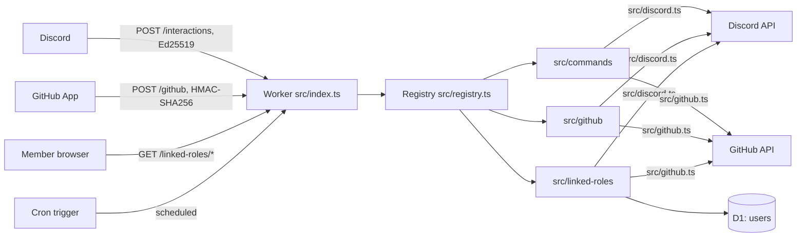

# OpenDrone Discord bot

A Cloudflare Worker that connects the OpenDrone Discord server to the
OpenDrone-hw GitHub organisation. It talks to Discord over HTTP only (no
gateway connection), so it receives interactions (commands, buttons, modals)
but no message, reaction or member events.



## State

| Part | State |
|---|---|
| Signature checks, PING, routing, 404 and 405 | Working |
| Discord REST client: rate limits, mention suppression, token redaction | Working |
| GitHub App auth: RS256 JWT, installation token cache | Working |
| `config/repos.json` loader and runtime name-to-id resolution | Working |
| `src/github/` webhook handlers | Stub: none registered, deliveries get 202 |
| `src/commands/` commands | Stub: none registered, `register-commands` has nothing to send |
| `src/linked-roles/` | Stub: its three routes answer 501, no metadata |

## Layout

| Path | Content |
|---|---|
| `src/index.ts` | Entry point and route table |
| `src/registry.ts` | The `BotModule` contract every module implements, and its dispatch rules |
| `src/interactions.ts` | `POST /interactions` and the reply helpers `messageResponse`, `ephemeral`, `defer` |
| `src/webhooks.ts` | `POST /github` |
| `src/verify.ts` | Ed25519 and HMAC-SHA256 checks |
| `src/discord.ts` | Discord REST client |
| `src/github.ts` | GitHub App client |
| `src/config.ts` | `config/repos.json` validation, `findRepo`, `Directory` (name to id, cached per isolate) |
| `src/services.ts` | Per-request bundle of env, clients and directory |
| `config/repos.json` | Repository to forum and product tag, channel and role names |
| `migrations/` | D1 schema |
| `scripts/` | `register-commands.ts`, `register-metadata.ts` |
| `test/` | vitest suites, offline |

## Behaviour every module inherits

| Rule | Where |
|---|---|
| A request with a bad or missing signature gets 401 | `src/verify.ts` |
| Interactions older than 300 s are rejected | `src/verify.ts` |
| Interactions from any guild other than `GUILD_ID` get an ephemeral refusal | `src/interactions.ts` |
| Every message the bot sends carries `allowed_mentions: {parse: []}` unless the caller sets `allowed_mentions` explicitly | `src/discord.ts`, `src/interactions.ts` |
| On 429 the client waits `retry_after` and retries (3 times); a wait over 20 s throws instead | `src/discord.ts` |
| Tokens in `/webhooks/{id}/{token}` and `/interactions/{id}/{token}` paths are redacted from errors | `src/discord.ts` |
| Mutating Discord calls carry the audit log reason `OpenDrone-hw/discord bot` unless given another | `src/discord.ts` |
| GitHub handlers run after the 202 reply; a failing handler is logged and does not stop the others | `src/webhooks.ts` |
| Channel, role and tag ids are resolved by name at runtime; no id is hard-coded | `src/config.ts` |

## `config/repos.json`

| Key | Meaning |
|---|---|
| `org` | GitHub organisation; repositories outside it are ignored |
| `channels` | `gitFeed`, `announcements`, `modLog`: channel names |
| `roles` | Role names by key (`admin`, `reviewer`, `verifiedBuilder`, ...) |
| `lifecycleTags` | `status-*` repository topic to forum tag name |
| `forums` | The development forum names |
| `repos` | Repository name to `{forum, tag}`; `tag` is the product tag in that forum |

Loading fails if a repository points at a forum not in `forums`, a tag repeats
within a forum, a tag is longer than 20 characters, or a forum's product and
lifecycle tags exceed Discord's 20.

## Check

Node 23.6 or newer (the scripts run TypeScript directly).

```sh
cd bot
npm ci
npm run check    # tsc --noEmit, then vitest run
```

Tests replace `fetch` and fail on any network access.

## Setup

Replace `<worker>` below with the Worker's URL, for example
`opendrone-discord-bot.<account>.workers.dev`. Every step is manual.

### 1. D1 database

```sh
npx wrangler d1 create opendrone-discord-bot
# put the printed database_id into wrangler.toml
npx wrangler d1 migrations apply opendrone-discord-bot --remote
```

### 2. GitHub App

GitHub: organisation OpenDrone-hw, Settings, Developer settings, GitHub Apps,
New GitHub App.

| Setting | Value |
|---|---|
| Callback URL | `https://<worker>/linked-roles/github/callback` |
| Expire user authorization tokens | On (issues refresh tokens) |
| Request user authorization (OAuth) during installation | Off |
| Webhook | Active, URL `https://<worker>/github`, secret = `GITHUB_WEBHOOK_SECRET` |
| Where can this GitHub App be installed | Only on this account |

| Repository permission | Access | Used for |
|---|---|---|
| Metadata | Read | Required by GitHub |
| Pull requests | Read and write | PR events, the `Discussion:` line in PR bodies, collision warnings |
| Contents | Read and write | Changed files, release assets, `/branch` |
| Issues | Read and write | "To GitHub issue" |
| Checks | Read | Check results |
| Commit statuses | Read | Status results |
| Administration | No access | Nothing. Without it the bot cannot create, delete, rename or transfer repositories, change repository settings or change branch protection |

| Organization permission | Access | Used for |
|---|---|---|
| Members | Read | `org_member` and `maintainer` linked-role metadata |

Do not grant Administration now: `/promote` is not implemented and
`PROMOTE_ENABLED` is `"false"`. Grant "Administration: Read and write" only
when `/promote` is implemented and `PROMOTE_ENABLED` is set to `"true"`,
preferably through a second GitHub App installed only on the repositories that
need it, so the main App key never carries it.

Events: Pull request, Pull request review, Check suite, Status, Release,
Repository, Organization, Membership.

After creating it: generate a private key and a client secret, then install the
App on OpenDrone-hw. The private key can stay in the PKCS#1 form GitHub
issues; the Worker converts it.

### 3. Secrets

`npx wrangler secret put <NAME>` for each; it prompts for the value.

| Name | Source |
|---|---|
| `DISCORD_PUBLIC_KEY` | Developer Portal, General Information, Public Key |
| `DISCORD_BOT_TOKEN` | Developer Portal, Bot, token |
| `DISCORD_CLIENT_ID` | Developer Portal, OAuth2, Client ID |
| `DISCORD_CLIENT_SECRET` | Developer Portal, OAuth2, Client Secret |
| `GITHUB_APP_ID` | GitHub App page, App ID |
| `GITHUB_APP_PRIVATE_KEY` | The downloaded `.pem`: `npx wrangler secret put GITHUB_APP_PRIVATE_KEY < key.pem` |
| `GITHUB_WEBHOOK_SECRET` | The webhook secret chosen in step 2 |
| `GITHUB_OAUTH_CLIENT_ID` | GitHub App page, Client ID |
| `GITHUB_OAUTH_CLIENT_SECRET` | GitHub App page, generated client secret |
| `SESSION_SECRET` | `openssl rand -base64 32` |

Vars (`GUILD_ID`, `APPLICATION_ID`, `PROMOTE_ENABLED`) are in `wrangler.toml`.
For `npm run dev`, copy `.dev.vars.example` to `.dev.vars` (git-ignored).

### 4. Deploy

```sh
npx wrangler deploy
```

### 5. Discord Developer Portal

Application `OpenDrone Dev` (1553748824470851644).

| Page | Field | Value |
|---|---|---|
| General Information | Interactions Endpoint URL | `https://<worker>/interactions` |
| General Information | Linked Roles Verification URL | `https://<worker>/linked-roles` |
| OAuth2 | Redirects | `https://<worker>/linked-roles/discord/callback` |

Discord checks the endpoint on save with a PING and a request with a bad
signature, so the Worker must be deployed with `DISCORD_PUBLIC_KEY` first.
With an endpoint URL set, all of this application's interactions go to the
Worker; a gateway process on the same application stops receiving them.

### 6. Register commands and metadata

Both scripts print what they would send and stop; `--yes` sends it. Each
replaces the whole list on Discord, so an empty list is refused. They read
`APPLICATION_ID` and `GUILD_ID` from the environment or `wrangler.toml`, and the
token from `DISCORD_BOT_TOKEN`, else `OPENDRONE_DISCORD_BOT_TOKEN` from the
environment or `~/.config/incutec/credentials.env`.

```sh
npm run register-commands
npm run register-commands -- --yes
npm run register-metadata
npm run register-metadata -- --yes
```

### 7. Attach linked roles

Discord: Server Settings, Roles, the role, Links, add `OpenDrone Dev` and set
its requirements. This has no API.

## Adding to a module

Each module's `index.ts` exports one `BotModule`; the contract, the dispatch
table and the time budgets are documented in `src/registry.ts`, with an example
at the top of each stub. A conflict between modules (same command, custom_id
prefix or route) fails at startup.

## Licence

MIT, as the rest of the repository.
